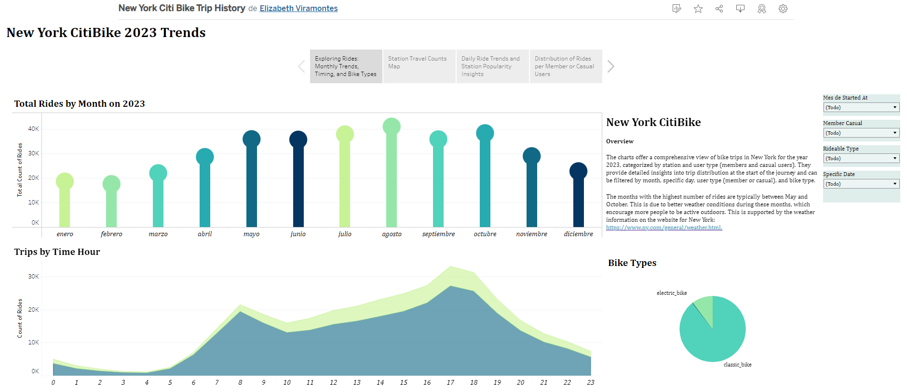
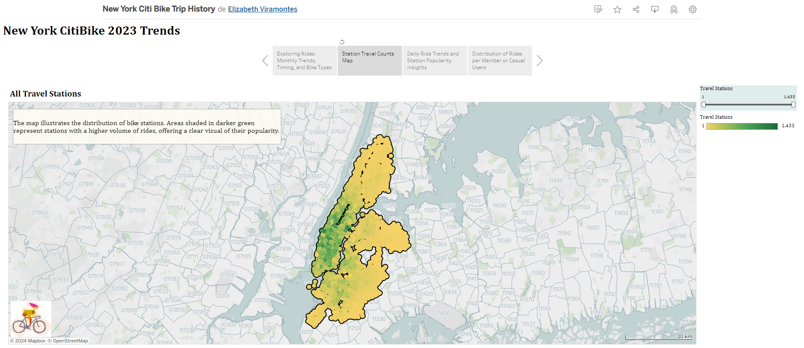

# ds_module_18_Tableau
Homework Module 18 Tableau
=========
Objective
----
The goal of this project is to put into practice the knowledge about Tablea a data visualization tool that helps to create interactive and shareable dashboards. It turns data into visually appealing charts and graphs, making it easier to understand and analyze information. 

Congratulations on your new job! As the new lead analyst for the [New York Citi Bike](https://en.wikipedia.org/wiki/Citi_Bike). program, you are now responsible for overseeing the largest bike-sharing program in the United States. In your new role, you will be expected to generate regular reports for city officials looking to publicize and improve the city program.

Since 2013, the Citi Bike program has implemented a robust infrastructure for collecting data on the program's utilization. Each month, bike data is collected, organized, and made public on the [Citi Bike](https://citibikenyc.com/system-data) webpage.

However, while the data has been regularly updated, the team has yet to implement a dashboard or sophisticated reporting process. City officials have questions about the program, so your first task on the job is to build a set of data reports to provide the answers.

Instructions
===
The task in this assignment is to aggregate the data found in the Citi Bike Trip History Logs and find two unexpected phenomena.

1. Design 2–5 visualizations for each discovered phenomenon (4–10 total).

2. Use your visualizations (not necessarily all of them) to design a dashboard for each phenomenon. The dashboards should be accompanied by an analysis explaining why the phenomenon may be occurring.

    - Create one of the following visualizations for city officials:

    - Basic: A static map that plots all bike stations with a visual indication of the most popular locations to start and end a journey, with zip code data overlaid on top.

    - Advanced: A dynamic map that shows how each station's popularity changes over time (by month and year). Again, with zip code data overlaid on the map.

    - The map you choose should also be accompanied by a write-up describing any trends that were noticed during your analysis.

4. Create your final presentation:

    - Create a Tableau story that brings together the visualizations, requested maps, and dashboards.

    - Ensure your presentation is professional, logical, and visually appealing.

Considerations
===
Remember, the people reading your analysis will NOT be data analysts. Your audience will be city officials, public administrators, and heads of New York City municipal departments. Your data and analysis need to be presented in a way that is focused, concise, easy to understand, and visually compelling. Your visualizations should be colorful enough to be included in press releases, and your analysis should be thoughtful enough to inform programmatic changes.

Assessment
===
Your final product will be assessed on the following metrics:

- Analytic Rigor

- Readability

- Visual Appeal

Access the Dashboard in Tableau
---
You can view the Tableau dashboard by clicking on the following link: 
[New York CitiBike 2023 Trends](https://public.tableau.com/app/profile/elizabeth.viramontes/viz/NewYorkCitiBikeTripHistory/Story1)

Feel free to explore the data and insights presented.